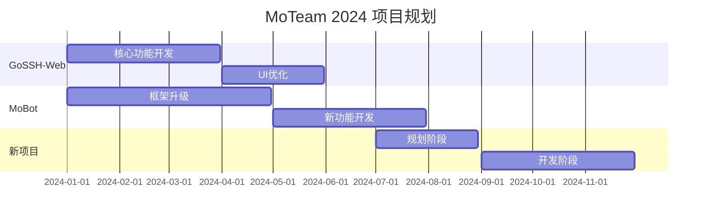

# 欢迎来到 MoTeam 👋

  
  
  # MoTeam
  
  _创立于 2023.2.1 的开源技术团队_

  
  
  

## 🚀 主要项目
### 🛠 开发工具类
<table>
  <tr>
    <td><b>项目</b></td>
    <td><b>描述</b></td>
    <td><b>技术栈</b></td>
    <td><b>状态</b></td>
  </tr>
  <tr>
    <td><a href="https://github.com/MoTeam-cn/GoSSH-Web">GoSSH-Web</a></td>
    <td>基于 Web 的 SSH 终端客户端</td>
    <td>
      
      
    </td>
    <td>🟢 活跃开发</td>
  </tr>
  <tr>
    <td><a href="https://github.com/MoTeam-cn/MoBot">MoBot</a></td>
    <td>现代化 Telegram 机器人框架</td>
    <td>
      
    </td>
    <td>🟢 活跃开发</td>
  </tr>
  <tr>
    <td><a href="https://github.com/MoTeam-cn/MoProxy">MoProxy</a></td>
    <td>高性能代理工具</td>
    <td>
      
    </td>
    <td>🟡 维护中</td>
  </tr>
  <tr>
    <td><a href="https://github.com/MoTeam-cn/MCServerRadar">MCServerRadar</a></td>
    <td>Minecraft 服务器监控工具</td>
    <td>
      
    </td>
    <td>🟡 维护中</td>
  </tr>
  <tr>
    <td><a href="https://github.com/MoTeam-cn/Mo-MoTrix">Mo-MoTrix</a></td>
    <td>全功能下载管理器</td>
    <td>
      
    </td>
    <td>🟡 维护中</td>
  </tr>
</table>

## 📈 项目统计

### 语言分布

### 项目状态

### 仓库统计

### 开发活跃度

## 🎯 2024 发展规划

## 🤝 加入我们
我们正在寻找充满热情的开发者！
### 我们期待：
- 🔥 对开源充满热情
- 💡 有创新精神
- 🤝 善于团队协作
- 📚 热爱学习成长

### 技术要求：
- Go/Python/JavaScript 任一语言精通
- 基本的 Git 使用经验
- 良好的编码习惯

## 📫 联系方式

## 📊 团队数据

---

    <i>用技术改变世界 - MoTeam</i>

